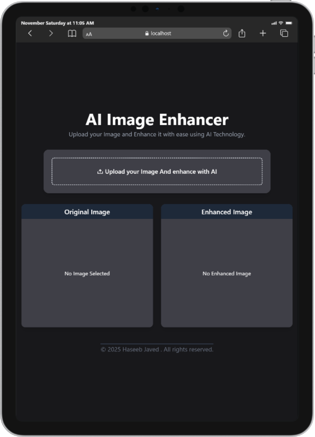
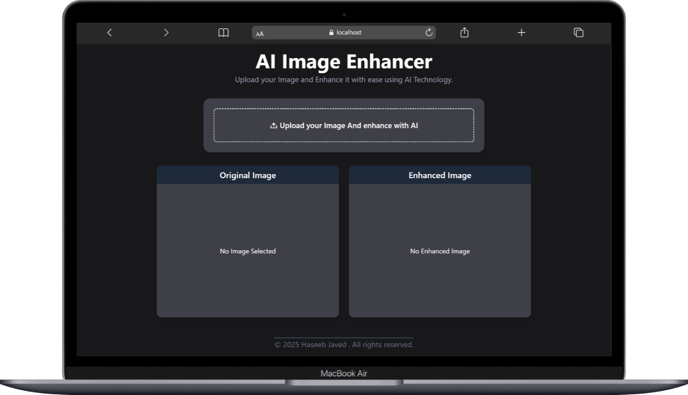

<h1 align="center">  AI Powered Image Enhancer</h1>

A modern web application that allows users to upload images and enhance them using AI technology. Built with React, Vite, TailwindCSS, and integrates with the PicWish photo-enhancement API.

---

## Features

- **AI-Powered Image Enhancement:** Upload an image and enhance it via an external AI API.
- **Live Preview:** See both the original and enhanced images side by side.
- **Loading State:** Visual feedback while processing.
- **Responsive UI:** Built with TailwindCSS for modern, mobile-friendly design.
- **Mock Mode:** Develop UI without consuming API credits.

---

## Responsive Demo

Here are sample device previews of the responsive UI:

<p align="center">
   
   
   
</p>

## Project Structure

```
Image Enhancer/
├── public/
│   └── Fav-Icon/
├── src/
│   ├── components/
│   │   ├── Home.jsx
│   │   ├── ImageUpload.jsx
│   │   ├── ImagePreview.jsx
│   │   └── Loading.jsx
│   ├── Utils/
│   │   └── enhancedImageApi.js
│   ├── App.jsx
│   ├── index.css
│   └── main.jsx
├── .env.example
├── index.html
├── package.json
├── vite.config.js
├── eslint.config.js
└── README.md
```

---

## Core Logic & Flow

1. **App Initialization:**  
   The app is rendered in **main.jsx** mounting the **App.jsx** component.

2. **User Uploads Image:**
   - **ImageUpload.jsx** provides a file input.
   - On file selection, it calls `UploadImageHandler` in **Home.jsx**.
3. **Image Enhancement Process:**

   - `UploadImageHandler` sets the local preview and triggers the enhancement API via **enhancedImageApi**.
   - The API logic:
     - **uploadImage:** Sends the image to the API, receives a `task_id`.
     - **PollForEnhancedImage:** Polls the API until the enhancement is complete or a retry limit is reached.
     - **fetchEnhancedImage:** Retrieves the enhanced image URL.
   - On success, the enhanced image URL is stored in state.

4. **UI Updates:**
   - [ImagePreview.jsx] displays both the original and enhanced images.
   - [Loading.jsx] shows a spinner while waiting for the enhancement.

---

## API Integration

- **Service:** PicWish photo-enhancement API.
- **Endpoints:**
  - `POST /api/tasks/visual/scale` — Uploads image, returns `task_id`.
  - `GET /api/tasks/visual/scale/{task_id}` — Polls for enhanced image.
- **API Key:** Required (see [Environment Variables](#environment-variables)).
- **Retries:** Polls up to 20 times, waiting 2 seconds between each.

---

## Environment Variables

Create a `.env` file in the project root (see `.env.example`):

```env
# Use mock mode (no real API calls)
VITE_USE_MOCK=true

# For real API usage:
# VITE_USE_MOCK=false
# VITE_API_KEY=your_real_api_key
# VITE_BASE_URL=https://techhk.aoscdn.com
# VITE_VERBOSE_DEBUG=true
```

- **VITE_USE_MOCK:** Enables mock mode for development.
- **VITE_API_KEY:** Your PicWish API key.
- **VITE_BASE_URL:** API base URL.
- **VITE_VERBOSE_DEBUG:** Optional, enables debug logs.

---

## Setup & Development

1. **Install dependencies:**

   ```bash
   npm install
   ```

2. **Configure environment:**

   - Copy `.env.example` to `.env` and adjust as needed.

3. **Run the development server:**

   ```bash
   npm run dev
   ```

4. **Build for production:**

   ```bash
   npm run build
   ```

5. **Preview production build:**
   ```bash
   npm run preview
   ```

---

## Scripts

- `npm run dev` — Start development server.
- `npm run build` — Build for production.
- `npm run preview` — Preview production build.
- `npm run lint` — Run ESLint checks.

---

## Dependencies

- **React** (UI framework)
- **Vite** (build tool)
- **TailwindCSS** (utility-first CSS)
- **Axios** (HTTP requests)
- **Remixicon** (icon set)
- **ESLint** (code linting)

---

## ESLint & Code Quality

- ESLint is configured in **eslint.config.js** with recommended rules for JS, React, and React Hooks.
- Run `npm run lint` to check code quality.

---

## Customization

- **Styling:** Modify **index.css** or Tailwind config.
- **API Logic:** Adjust **enhancedImageApi.js** for different APIs or enhancement logic.
- **UI Components:** Extend or replace components in **src/components/**.

---

## License

&copy; 2025 Haseeb Javed. All rights reserved.

---

**For any issues or contributions, please open an issue or pull request.**
